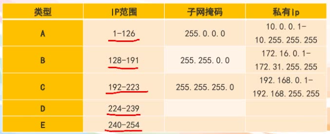

# 国网考试

- [国网考试](#%E5%9B%BD%E7%BD%91%E8%80%83%E8%AF%95)
    - [专业知识](#%E4%B8%93%E4%B8%9A%E7%9F%A5%E8%AF%86)
        - [计算机基础](#%E8%AE%A1%E7%AE%97%E6%9C%BA%E5%9F%BA%E7%A1%80)
        - [电工学](#%E7%94%B5%E5%B7%A5%E5%AD%A6)
        - [电子技术](#%E7%94%B5%E5%AD%90%E6%8A%80%E6%9C%AF)
        - [微机原理](#%E5%BE%AE%E6%9C%BA%E5%8E%9F%E7%90%86)
        - [自动控制理论](#%E8%87%AA%E5%8A%A8%E6%8E%A7%E5%88%B6%E7%90%86%E8%AE%BA)

## 专业知识

### 计算机基础

1. 计算机基础知识（计算机定义、组成、进制、操作系统等）
    1. 定义：现代一种用于高速计算的电子计算机器，可以进行数值计算，又可以进行逻辑计算，还具有存储记忆功能。是能够按照程序运行，自动、高速处理海量数据的现代化智能电子设备。
    2. 冯诺依曼结构：输入数据和程序的输入设备；记忆程序和数据的存储器；完成数据加工处理的运算器；控制程序执行的控制器；输出处理结果的输出设备。
    3. 计算机组成
        1. 硬件系统
            1. 主机
                1. cpu：运算器、控制器、寄存器
                2. 内存储器：
                    1. ROM只读存储器（PROM可编程只读存储器，EPROM可擦可编程序只读存储器，EEPROM电可擦可编程只读存储器）
                    2. RAM随机存储器（掉电丢失，SRAM静态RAM，DRAM动态RAM需要刷新）
            2. 外设
                1. 外存储器
                2. IO设备
                    1. 输入设备
                    2. 输出设备
        2. 软件系统
            1. 系统软件：操作系统、数据库管理系统DBMS/DMS等
            2. 应用软件：为了完成某些特殊功能
    4. 计算机数制采用二进制。
    5. 进制转换，二进制、八进制、十进制、十六进制
    6. 计算机应用：
        1.  科学计算（最早）
        2.  数据处理（最多）
        3.  数据库应用
        4.  过程控制（实时控制）是指极端及对被控对象进行数据采集、检测和处理，按最佳状态来控制或调节被控对象的一种方式
        5.  计算机辅助应用
            - 计算机辅助工程CAE
            - 计算机辅助测试CAT
            - 计算机辅助制造CAM
            - 计算机辅助教学CAI
            - 计算机辅助设计CAD
        6. 人工智能AI，用计算机来模拟人的只能行为。
            1. 决策支持系统不属于AI应用
    7.  计算机发展方向：巨型化、微型化、多媒体化、智能化
    8.  操作系统：操作系统是连接计算机硬件和软件的纽带，是计算机系统中最基本也是最核心的系统软件。一般来讲，所谓操作系统是指能合理而且有效的管理计算机所有阴间资源和软件资源的系统软件。
        1. 裸机：没有安装操作系统的进算计
    9. 操作系统的功能
        1. 从用户角度看，操作系统是用户和计算机的接口
        2. 处理器管理
        3. 存储器管理
        4. 设备管理：指外部设备
        5. 作业管理
        6. 文件管理（树形结构）：存储空间的分配和回收，文件的读写、查找、共享
    10. 操作系统分类
        1. 单道批处理操作系统：用户一次可以提交多个作业，但负责调度作业的程序每次只向内存调入一个作业，系统一次也只处理一个作业，失去交互性。
        2. 多道批处理操作系统：内存同时保存多个作业，CPU以交替的方式处理各个程序。当一个作业由于等待输入输出操作而让处理器出现空闲时，系统可以自动进行切换，处理另一个作业。
        3. 分时操作系统：结合了交互处理与多道批处理的特点。
        4. 实时操作系统：可以及时响应外部时间的请求。
        5. 网络操作系统：通常运行在服务器上的操作系统，其目标是相互通信和资源共享。
        6. 微机操作系统
2. 网络技术基础（定义、拓扑结构、协议、差错控制、Internet）
    1. 定义：计算机网络是指将地理位置不同的具有独立功能的多台计算机及其外部设备，通过通信线路连接起来，在网络操作系统，网络管理软件及网络通信协议的管理和协调下，实现资源共享和信息传递的计算机系统。在协议管理下的多机互联系统。
    2. 起源：美国 ARPA net 1969 军事用途
    3. 网络分类：
        1. 按照覆盖范围：局域网LAN（范围小、用户少、效率高）、城域网MAN（10-100km，局域网的延申）、广域网WAN（几百-几千km，信息衰减比较严重）
        2. 按拓扑结构分：
            1. 星型网络（局域网用）
            2. 环形网络（局域网用、令牌环网）
            3. 总线型网络（广播式、以太网、广泛）
            4. 树形网络（容错）
            5. 网状网络（稳定性更好）
        3. 通信方式
            1. 客户服务器方式（C/S方式）
            2. 对等连接（P2P），任何一方都可以作为服务请求方和服务提供方。
        4. 按照网络中各种设备功能
            1. 资源子网：包括联网的计算机、终端、外部设备、网络协议和网络软件。他的主要任务时负责收集、存储、和处理信息，为用户提供网络服务和资源共享功能。
            2. 通信子网：把各个站点连接起来的通信系统，主要包括通信线路、网络连设备、网络协议和通信控制软件。
    4. OSI参考模型
        1. 
    5. 网络设备
        1. 中继器：信号的放大和再生，在物理层
        2. 集线器：多端口中继器，在物理层
        3. 网桥：扩展局域网，连接两个协议相同的局域网，在链路层
        4. 交换机：用于电信号转发，在链路层
        5. 网关：网络层以上实现网络互联，连接两个高层协议不同的网络
        6. 路由器：连接两个不同的网络（局域网、广域网），路由选择，以最佳路径传输，在网络层
        7. 调制解调器：数字信号和模拟信号转换，拨号上网必备，调制D/A，解调A/D
        8. 网络适配器（网卡）：计算机入网必备
    6. 协议三要素：语法、语义、时序（同步）
    7. 网络地址
        1. IP地址：Internet网络为每台计算机分配的唯一标识，32位地址（4字节），由网络号和主机号组成
        2. 点分十进制的标识形式
        3. 
3. 多媒体技术基础（媒体定义、多媒体组成、数据压缩）
    1. 媒体：指传播信息的载体，如语言、文字、图像、视频、音频等等
    2. 多媒体技术：是利用计算机对文本、图形、图像、声音、动画、视频等多种信息综合处理、建立逻辑关系和人机交互作用的技术。
4. 信息安全技术(定义、风险及防范、病毒及防范、加密技术）
5. 信息科学前沿（云计算、传感网、人工智能、数据挖掘、机器学习）
    1. 云计算
    2. 传感网
    3. 人工智能AI
    4. 数据挖掘
    5. 机器学习

### 电工学

1. 电路的基本概念及定律
    1. 概念
        1. 电流：科学上把单位时间里通过导体任一横截面的电量叫做电流强度，简称电流。 i = dq / dt
        2. 电压：也称作电势差或电位差，是衡量单位电荷在静电场中由于电势不同所产生的能量差的物理量。 u = dw / dq
        3. 电动势：是反映电源把其他形式的能转换成电能的本领的物理量。
        4. 电位（电势）
        5. 功率：单位时间内电场力所做的功。 p = dw / dt = ui
    2. 定律
        1. 欧姆定律 I = U / R
        2. 基尔霍夫电流定律KCL：在任一时刻，流入某结点的电流之和必定等于流出该结点的电流之和
        3. 基尔霍夫电压定律KVL：从任意一点出发，沿回路巡行一周，电位升之和必定等于点位降之和
    3. 支路电流法：支路电流分析法是以电路中的各支路电流为未知量，直接应用KCL和KVL来列出支路电流的方程，然后从所列方程中解出各支路电流。
    4. 电源等效变换法
        1. 实际电压源 = 理想电压源 串 内阻 = 理想电流源 并 电阻
        2. 电压源并联电可忽略，电流源串电阻可忽略
    5. 结点电压法
    6. 叠加定理：对于一个线性系统，一个含多个独立源的双边线性电路的任何支路的响应（电压或电流），等于每个独立源单独作用时的响应的代数和，此时所有其他独立源被替换成他们各自的阻抗。
    7. 戴维宁定理：任何一个线性有源二端网络都可以等效为一个电压源模型（电压源短路，电流源断路，推算二端网络可以用开路短路法：开路求电压，短路求内阻）
    8. 诺顿定理：任何一个线性有源二端网络都可以等效为一个电流源模型
2. 正弦交流电的分析
    1. 三要素：幅值、频率ω、初相位ψ
    2. 瞬时值：u，i；幅值：Um，Im；有效值 U = Um / 2^0.5 I = Im / 2^0.5
    3. 角频率 ω = 2*pi*f = 2*pi/T
    4. 有功功率：P = UIcos(φ)；功率因数φ = ψU - ψI
       无功功率：Q = UIsin(φ)
       复功率：S = P + jQ；视在功率时复功率的模 S = (P² + Q²)^0.5
    5. 电阻元件：P = UI = I²R
       电感元件：u = L*di/dt, Um/Im = U/I = ωL = 2*pi*fL；感抗XL = ωL；电压超前电流90°；功率P = 0, Q = UI
       电容元件：u = C*du/dt, Um/Im = U/I = 1/(ωC) = 1/(2*pi*fC)；容抗Xc = 1/(ωC)；电流超前电压90°；功率P = 0, Q = -UI
    6. 提高功率因数方法：1.提高自然功率因数；2.提高功率因数的补偿方法（并联电容器）
3. 放大电路基本概念
4. 集成运算放大器的运算功能
5. 晶体管（三极管）的结构和特性
    1. 晶体管是一种固体半导体器件，可以用于放大、开关、稳压、信号调制和许多其他功能
    2. 分类：双极性晶体管(BJT)、场效应晶体管(FET)
    3. 结构：基极B、射极E、集电极C
6. 数据采集系统的组成与功能
    1. 传感器：将非电量信号转换成电信号
    2. 信号调理电路：进行信号的转换和标准化
    3. 多路模拟开关：共用其他电路，节省成本
    4. 采样保持电路：当对模拟信号进行A/D转换时，需要一定的转换时间，在这个转换时间内，模拟信号要保持基本不变，这样才能保证转换精度
    5. A/D转换：将模拟信号转换成数字信号
    6. 计算机及输出设备：显示、绘图、打印
7. 变压器的结构及工作原理
    1. 变压器利用电磁感应原理，把一种电压的交流电转换成同频率的另一种交流电
    2. 铁芯、原边绕组、副边绕组
8. 三相异步电动机的结构与原理
    1. 结构：定子（铁芯、绕组）、转子（笼型、绕线型）、气隙
    2. 工作原理：当电动机的三相定子绕组（各相差120度电角度），通入三相对称交流电后，将产生一个旋转磁场，该旋转磁场切割转子绕组，从而在转子绕组中产生感应电流（转子绕组是闭合通路），载流的转子导体在定子旋转磁场作用下将产生电磁力，从而在电机转轴上形成电磁转矩，驱动电动机旋转，并且电机旋转方向与旋转磁场方向相同。
    3. 工作状态
        1. 电动机状态：转子转速<定子磁场转速，0<转差率s<1
        2. 发电机状态：转子转速>定子磁场转速，转差率s<0
        3. 电磁制动状态：转子转速与同步转速相反，转差率s>1

### 电子技术

1. 双极型晶体管(BJT)的输入、输出伏安特性
2. BJT 共射极电路的静态分析和增益、输入电阻、输出电阻计算
3. BJT 组成的差动放大电路的静态和动态分析
4. 反馈的分类判断
5. 基于虚短虚断分析的运放电路
6. 逻辑代数基础和卡诺图化简
7. 组合逻辑电路的分析和设计
8. 触发器逻辑功能及时序波形分析
9. 基于集成触发器的同步计数器分析和设计
10. 基于同步集成计数器的任意模值计数器分析和设计

### 微机原理

1. 微型计算机的发展与分类
2. 数制与数制之间的相互转换
3. 码制及其运算
    1. 原码、反码、补码
    2. ASCII
4. 处理器的基本机构和功能
5. 指令的执行过程
6. 存储器体系结构
7. 存储器与CPU的连接方式与扩展
8. 8086微处理器寻址方式
9.  8086微处理器的指令系统
10. 汇编语言语句格式
11. 汇编语言程序基本结构与设计方法
12. BIOS中断和DOS系统功能调用
13. 微型计算机输入输出（I/O）方式
14. I/O接口的基本结构与端口的编址方式
15. 8086的中断系统
16. 可编程并行I/O芯片8255A
17. 可编程的计数/定时器8053
18. 串行通信基本概念

### 自动控制理论

1. 自动控制系统的一般概念
    1. 自动控制：在没有人直接参与的情况下，利用控制装置使被控对象的某一物理量自动按照预定的规律运行的控制称为自动控制
    2. 自动控制的基本方式：
        1. 开环控制
        2. 闭环控制
        3. 复合控制
    3. 比较：
        1. 开环结构简单、成本低、工作稳定、不能主动修正、抗干扰能力差、精度不高
        2. 闭环有自动修正能力、有较高的精确度和抗干扰能力
    4. 反馈：通常将被控量经反馈装置引导输入端并与输入信号惊醒比较，这个过程称为反馈
    5. 控制系统基本组成：
        1. 给定元件
        2. 测量元件
        3. 比较元件
        4. 执行元件
        5. 控制对象
    6. 对控制系统的基本要求
        1. 稳定性
        2. 快速性
        3. 准确性
    7. 自动控制系统分类（书）
        1. 按输入信号特征分类：恒值控制系统（又称自动调节系统）、随动控制系统（又称伺服系统）、程序控制系统
        2. 按系统中传递信号的变化特征分类：连续控制系统、离散控制系统
        3. 按系统特性分类：线性控制系统、非线性控制系统
        4. 按系统参数是否随时间变化分类：定常系统、时变系统
2. 自动控制系统的数学模型
    1. 微分方程的建立
        1. 数学模型：是描述系统动态特性及各变量之间关系的数学表达式。控制系统定量分析的基础
        2. 数学模型的特点：
            1. 相似性
            2. 简化性和准确性
            3. 动态模型
            4. 静态模型
        3. 数学模型的类型：
            1. 微分方程：时域
            2. 传递函数：复频域
            3. 频率特性：频域
        4. 数学模型的建立方法
            1. 分析法
            2. 实验法
        5. 获取微分方程的步骤
            1. 了解系统的工作原理，列出输入量、输出量
            2. 列写原始方程
            3. 消去中间变量
            4. 写出描述输入-输出干系微分方程
    2. 拉普拉斯变换
        1. 定义
        2. 线性定理
        3. 微分定理
        4. 积分定理
        5. 初值定理
        6. 中值定理
        7. 单位阶跃函数
        8. 单位脉冲函数
        9. 单位斜坡函数
        10. 单位抛物线函数
        11. 正弦函数
        12. 幂函数
        13. 拉氏反变换定义
        14. 拉式反变换求解
    3. 传递函数
        1. 定义：线性定常系统在零初始条件下输出量的拉氏变换与输入量的拉氏变换之比
        2. 传递函数的数学表达式
        3. 典型环节的传递函数
            1. 比例环节
            2. 惯性环节
            3. 积分环节，具有记忆功能
            4. 微分环节：理性、实际RC
            5. 振荡环节
            6. 滞后环节（延迟环节）
    4. 系统动态结构图（方块图）
        1. 定义
        2. 绘制
        3. 等效变换
    5. 信号流图（书）
        1. 梅逊公式：计算输入节点到输出节点之间总增益的梅逊增益公式
    6. 状态空间模型
3. 自动控制系统的时域分析
    1. 自动控制系统的时域指标
        1. 时域分析法：在给定输入条件下，利用系统输出随时间变化情况对系统分析的方法。通常用暂态性能指标衡量。特点：直观、准确，适用于低阶系统
        2. 控制系统的基本要求：
            1. 系统应该是稳定的
            2. 系统达到稳定时应满足给定的稳态误差要求
            3. 系统在暂态过程中应满足暂态品质的要求
        3. 典型输入信号
            1. 脉冲信号δ(t)，拉氏变换=1
            2. 阶跃信号，单位阶跃信号拉氏变换=1/s
            3. 斜坡信号，单位斜坡信号拉氏变换=1/s²
            4. 加速度信号（抛物线信号）1/s^3
            5. 正弦信号 ω/(s²+ω²)
        4. 典型时间响应：单位脉冲响应、单位斜坡响应、单位斜坡响应、单位加速度响应
        5. 典型时间响应基本性质
            1. 线性定常系统对输入信号导数（积分）的响应，等于系统对输入信号相应的导数（积分）
            2. 单位脉冲响应的拉氏变换即系统传递函数
            3. 利用系统的单位脉冲传函g(t)，可求出任意输入信号下的输出相应
        6. 性能指标（书）：暂态性能指标和稳态性能指标
    2. 一二阶系统的阶跃响应及改善措施
        1. 一阶系统的数学模型
        2. 一阶系统的单位阶跃响应
        3. 一阶系统的性能指标
            1. 一阶系统的瞬态性能指标
                1. 延时时间td，输出响应第一次达到稳定值的50%所需的时间 = 0.693T
                2. 上升时间tr，一阶系统输出响应从10%稳定值到90%稳定值的时间 = 2.197T
                3. 调整时间ts，误差达到规定允许值Δ所需时间ts = 4T(Δ=0.02), 3T(Δ=0.05)
                4. 峰值时间tp和超调量δ%，一阶系统没有震荡，tp和超调量都没有
            2. 减小一阶系统时间常数的措施(书)
                1. 通过负反馈来减小时间常数
                2. 在系统的前向通道上串联一个比例环节α
        4. 特点：曲线从零开始，按指数规律上升，最终趋于1，无超调，稳态误差ε(∞)=0
        5. 二阶系统的数学模型
        6. 欠阻尼二阶系统（0<ζ<1）有超调、有震荡
        7. 临界阻尼二阶系统（ζ=1）无超调、无震荡
        8. 过阻尼二阶系统（ζ>1）无震荡、无超调
        9. 无阻尼系统（ζ=0）等值震荡
        10. 欠阻尼二阶系统主要动态性能指标
            1. 超调量
            2. 调节时间
        11. 比例微分控制PD，响应速度加快，超调量和调整时间减小
        12. 速度反馈控制，使系统的阻尼增大，无阻尼振荡频率不变，从而引起系统的超调量和调整时间下降
        13. 最佳阻尼系数ζ=0.707，小了超调严重，大了响应太慢，超调量<0.05
    3. 稳定性判据
        1. 稳定性定义
            1. 稳定（绝对稳定）充要条件是传递函数的全部极点均在s左半平面
            2. 临界稳定
            3. 相对稳定
            4. 不稳定
        2. 稳定性判据
            1. 劳斯判据：劳斯阵列第一列元素无符号变化则系统稳定，符号变化次数为特征方程的根在s右半平面的个数
            2. 赫尔维茨稳定判据
            3. 林纳德-奇帕特判据
            4. 根轨迹法
            5. 奈奎斯特判据
            6. 李雅普诺夫第二方法
    4. 稳态误差
        1. 定义：稳态条件下输出量的期望值与稳态值之间存在的误差，系统的稳态误差与系统结构有关，还与输入信号的大小及形式有关。而系统的稳定性只取决于系统的结构
        2. 稳态误差
            1. 干扰误差
            2. 输入误差
            3. 总误差
        3. 输入误差决定因素：系统开环传递函数的型次、输入信号
        4. 系统开环传递函数型次
        5. 典型输入情况下的输入稳态误差
4. 自动控制系统的根轨迹法
    1. 根轨迹法定义：根据开环零极点分布，是系统某参数由零版哈到无穷大，绘制出闭环极点在s平面上相应的变化轨迹，由此分析系统性能及对系统进行综合校正
    2. 根轨迹法的基本任务：由已知开环零极点分布及根轨迹增益，通过图解的方法找出闭环极点
    3. 研究根轨迹的目的：分析系统的各种性能（稳定与、稳定性能、动态性能）及参数对系统性能的影响
    4. 根轨迹相关概念
        1. 开环零点：指系统开环传递函数中分子多项式方程的根
        2. 开环几点：指系统开环传递函数中分母多项式方程的根
        3. 闭环零点：指系统闭环传递函数中分子多项式方程的根
        4. 开环增益：开环放大系数K
    5. 根轨迹方程
    6. 根轨迹法则
        1. 根轨迹起始于开环极点，终止与开环零点，如果开环零点数m小于开环极点数n，则由（n-m）条根轨迹终止与无穷远处
        2. 根轨迹是对称于实轴的连续曲线，其分支等于系统开环零点和极点数目中的大者
        3. 若实轴上某点右边开环零极点数目之和为奇数，则该点是根轨迹上的点
        4. 根轨迹的渐近线，实轴交点、倾角（与实轴夹角）
        5. 根轨迹的分离（会合）点，实质就是闭环特征方程的重根，分离角和会合角
        6. 根轨迹的出射入射角
        7. 根轨迹与虚轴焦点
        8. 系统的闭环极点之和与之积
    7. 主导极点：就是动态过程影响站主导位置的极点，一般是离虚轴最近的极点
    8. 偶极子：一对零极点彼此相距很近，又靠近远点，且极点位于零点右侧，这样的零极点称为偶极点对或偶极子。偶极子对系统的影响忽略不计。
5. 线性系统的频域分析
    1. 频率特性：稳定性系统的频率特性等于输出傅里叶变换比上输入傅里叶变换
    2. 幅相频特性
        1. 幅频特性：稳态响应幅值与输入信号的幅值之比，他随频率变化。他描述系统对不同频率输入信号在稳态时的放大特性
        2. 相频特性：稳态响应与正弦输入信号的相位差，他描述系统的稳态响应对不同频率输入信号的相位移特性
    3. 常用的频率特性曲线
        1. 极坐标图，奈奎斯特图。以频率特性的实部为直角坐标系的横坐标，以虚部为纵坐标，以ω为参变量的幅值与相位的图解表示法
        2. 对数坐标图，伯德图。由对数幅频特性和对数相频特性两张图组成
        3. 对数幅相频率特性图，尼科尔斯图
6. 线性控制系统的设计
7. 离散控制系统分析
    1. 模拟信号：在时间和幅值上都连续的信号
    2. 离散模拟信号：在时间上离散，幅值上连续的信号
    3. 采样：时间轴上离散化
    4. 量化：
    5. 连续系统
    6. 离散系统
    7. A/D转换器
    8. D/A转换器
    9. 香农采样定理：ωs > 2ωmax
    10. 零阶保持器：滞后时间T/2
8. 线性控制系统基础（现代控制理论部分）
    1. 线性系统定义：如果一个系统的输入、输出满足叠加原理，该系统称为线性系统，否则为非线性系统。叠加原理包括叠加性及齐次性。
    2. 线性系统分类：
        1. 时变系统：如果系统的动态特性与控制系统的初始时刻及终止时刻有关，则该系统称为时变系统，也称非定常系统。
        2. 时不变系统：如果系统的动态特性只与控制过程的时间间隔有关，而与具体的初始时刻和终止时刻无关，则该系统称为时不变系统，又称定常系统
    3. 状态向量
    4. 状态空间
    5. 系统的状态空间表达式
