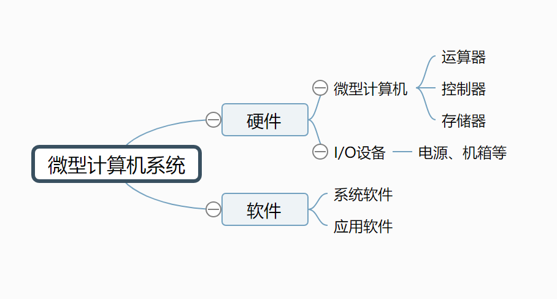
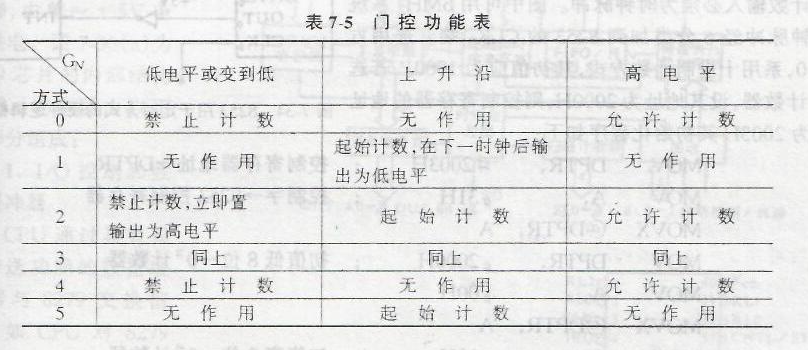

# 微机原理

1. 微型计算机的发展与分类
    1. 微型计算机介绍
        1. 微型计算机系统
            
        2. 微处理器：是指有一片或几片大规模集成电路组成的中央处理部件，包括运算器、控制器和一定数量的寄存器。它具有数学运算、逻辑判断、地址计算等功能，是微型计算机的核心。
        3. 微型计算机：是指以微处理器为基础，配以内存储器和输入输出接口电路和辅助电路构成一个相对独立的电路系统。这个电路系统可以是一个独立的集成电路，称为单片机。也可以是一块电路板，称为单板机。还可以是多块以一定方式连接在一起的电路板，常被称为个人计算机。
        4. 微型计算机系统：指微型计算机在配以相应的外围设备（如鼠标、键盘、显示器等），以及电源、机箱等硬件的基础上，安装必要的软件构成的系统，这个系统应该具有处理数据、数据存储、数据传输等基本功能。
    2. 微型计算机发展
        1. 第一代，1971年10月，Intel4004（4位微处理器）；1972年3月，Intel8008（8位微处理器）集成3500个晶体管
        2. 第二代，1973-1978，8位微处理器，Intel8080
        3. 第三代，1978-1983，16位微处理器，Intel8086
        4. 第四代，1983-2001，32位微处理器，Intel80386
        5. 第五代，2001年后，64位微处理器
    3. 微型计算机分类
        1. 按CPU字长分类：4位、8位、16位、32位、64位
        2. 按计算机的组成形式和系统规模分类
            1. 单片机：将CPU、RAM、ROM及I/O接口电路等部件集成在一块集成电路芯片上，以芯片形式出现的微型计算机。提供电源后可以独立工作，也可以连接一定的外围设备构成较复杂的系统。是目前使用量最大的一类微型计算机。常见Intel 51系列，Atmel AVR系列，Motorola的MC系列等
            2. 单板机：在一个电路板上集成了CPU，存储器、I/O接口电路和一定的输入输出设备，以单块电路板形式出现的微型计算机。提供电源口可以独立工作，也可以与外围输入输出设备进行连接构成更加复杂的系统。常见的由X86架构的PC104系统，ARM架构的单板机系统等
            3. 个人计算机：由微处理器芯片组装而成的、便于搬动而且不需要维护的计算机系统。
    4. 微型计算机组成
        1. 组成部件：微处理器（MPU）、输入输出接口（I/O）和内存储器（MEM）等三部分组成
            1. 微处理器：是微型计算机的核心部件，由大规模/超大规模集成电路构成，在微处理器中集成了预算其、控制器和一定数量的存储器组。其中运算器又称为算术逻辑单元（ALU）主要负责算术或逻辑运算以及移位循环等操作；控制器又称控制单元（CU），他是微机的指挥中心，用于完成指令读取，译码发出控制命令等操作；寄存器组（RS）也叫寄存器阵列（RA），是一株CPU内部的存储单元，分为通用寄存器和专用寄存器，通用寄存器用于临时存放运算的数据，专用寄存器用于存放一些特定的地址或状态参数。
            2. 输入/输出接口：输入/输出接口是微型计算机的重要组成部分，它包括输入接口和输出接口两部分。所谓输入/输出接口就是微型计算机与输入/输出设备之间的通道，这个通道按照一定的规则完成微型计算机与输入/输出设备的数据交换。在微型计算机中输入/输出接口通常是由专用集成电路构成，通过微型计算机的系统总线与处理器交换数据。
            3. 存储器：存储器是微型计算机的记忆核心，微型计算机中所有的数据和程序都是通过存储器保存的。微型计算机中的存储器主要分为内存储器和外存储器。内存储器用于数据处理过程中临时存放数据或程序，外存储器用于永久存储数据和程序
        2. 微型计算机的三总线结构
            1. 数据总线DB：微型计算机中所有的内存与输入/输出接口都是通过一组数据线预处理器或其他控制部件进行数据交换的，这一组数据线被称为数据总线。根据微型计算机处理数据能力不同，数据总线可分为8位、16位、32位、64位等
            2. 地址总线AB：微型计算机中与微处理器连接的内存和输入/输出接口数量巨大，为了使微处理器能够准确访问所有内存单元和输入/输出接口，每个内存单元和输入/输出接口都编有地址，微处理器通过一组地址线告知内存或输入/输出接口要操作的地址，从未准确地访问内存中的数据或输入/输出接口数据。这一组用于提供地址的线路称为地址总线。微处理器地址线的数量决定了微处理器可以访问的内存数量或输入/输出接口的数量。
            3. 控制总线CB：微型计算机中所有的部件都是在微处理器的控制和调度下运作的。为了控制这些部件工作血药微处理器提供一组特定功能的线路，这一组特定功能的线路称为控制总线。控制总线通常包括读写、等待、是能、测试、响应等多种控制信号，利用这些信号微处理器可以管理微型计算机中的各个部件，按一定的时序协调工作。
    5. 微型计算机工作原理
        1. 微型计算机的工作原理
            微型计算机是一个由时钟驱动的数字电路系统。微处理器在一个或几个时钟信号驱动下，完成一次操作，一系列的操作完成一定的数据处理任务。对于同一个微型计算机而言，时钟的快慢将决定完成一次操作时间的长短，也就决定了其处理数据的速度。不过受微处理器电路特性的限制，时钟频率往往只能在一定范围内调整。
            微型计算机的微处理器在时钟的驱动下，逐一读取特定地址开始的程序（所谓程序就是描述数据处理过程的指令序列），按程序制定的动作控制微机从硬盘或其他存储装置中装在操作系统程序到内训。操作系统程序装入内存后，微处理器转到操作系统所在的内存地址开始逐一执行程序，有操作系统对微机进行控制，实现人机交互，完成各种应用功能。
        2. 微型计算机基本工作流程
            1. 取指令：微处理器从存储器中简直零度去到微处理器内部，这是执行该指令的前提。读取指令首先要去认定指令所在的地址没这个地址由微处理器内部的指令指针寄存器存放。在开机或复位时，该指针寄存器只想某个固定地址，以后每读取一条指令自动修改该寄存器指向下一条指令地址。
            2. 分析指令：也称为指令译码，微处理器通过分析读取的指令的功能和操作对象等，从而为下一步执行做好准备。
            3. 执行指令：根据指令分析的结果，微处理器发出一些列控制信号，指挥各个部件完成该指令的功能，这样一条指令的执行就结束了。接着微处理器读取下一条指令进入下一个指令周期。微处理器就这样周而复始的执行程序中的指令并在指令控制下实现所需的功能。
2. 数制与数制之间的相互转换
    1. 二进制、八进制、十六进制
3. 码制及其运算
    1. BCD码，一个字节对一个十进制符号编码称为非压缩BCD码，四位二进制数对每个十进制符号进行编码称为压缩BCD码
    2. 有符号数
        1. 原码，最高位是符号位
        2. 反码，按位取反
        3. 补码，正数的补码与其原码相同；负数的补码是正数反码+1。
        4. 有符号数加减法预算，用补码进行
        5. 有符号数溢出判断：在运算中如果数值绝对值超出所用二进制书的表示范围，则最高位将产生进位，对符号位产生影响，从而出现正数相加变负数，负数相加变正数的情况，这种情况称为溢出。
4. 处理器的基本机构和功能
    1. 结构
        1. 运算器ALU：又称算术逻辑单元，是计算机的核心功能部件，负责完成算术运算、逻辑运算及位移循环等功能。
        2. 控制器CU：是计算机工作的指挥中心，负责按照一定顺序自动读取程序中的指令，对指令译码后将指令转换成相应控制信号，利用个控制信号指挥各部件协同工作。
        3. 寄存器组RS：是CPU中暂存数据和指令的逻辑部件，每个逻辑部件具有固定名称，固定长度，以及相对固定的功能，通常根据各寄存器功能的不同分为通用寄存器和专用寄存器。寄存器中进行取操作比内存中的存取操作快很多因此主要起到数据准备、调度和缓冲作用。
    2. 功能：CPU负责微型计算机中各部件的协调，完成指令的执行和数据处理工作，其功能主要体现在4个方面
        1. 指令控制：也称为程序顺序控制，使计算机中的指令或程序严格按照规定的顺序执行
        2. 操作控制：将程序指令所产生的一系列控制信号分别送往相应的部件，从而控制这些部件按指令的要求完成规定的功能
        3. 时间控制：使计算机中各类控制信号严格按照时间上规定的先后顺序进行操作，以完成时序控制和总线操作
        4. 数据加工：是指对数据进行算术运算和逻辑运算等操作，或对其他信息进行处理
    3. 微处理器主要性能指标
        1. 主频
        2. 前端总线FSB：北桥负责CPU与内存之间的数据交换工作
        3. 地址总线宽度：32位可以访问4GB的物理内存空间
        4. 数据总线宽度
        5. 高速缓存级数和容量
        6. 生产工艺
        7. 其他
5. 指令的执行过程
    1. 几乎所有的冯•诺伊曼型计算机的CPU，其工作都可以分为5个阶段：取指令、指令译码、执行指令、访存取数和结果写回。
6. 存储器体系结构
    1. 概述：内存储器一般由存储体、读写电路、地址译码电路和控制电路组成。内存储器通过数据、地址和控制总线与cpu交换信息。
    2. 存储器技术指标：容量、速度、带宽、可靠性
    3. 分类：
        1. 随机存取存储器RAM
            1. SRAM：不需要刷新电路，功耗较大，容量较小，存取速度快，多做缓存
            2. DRAM：容量大，功耗低，速度较慢，需要刷新电路
        2. 只读存储器ROM
            1. ROM，用户无法修改
            2. PROM，可编程ROM，一次性写入ROM
            3. EPROM，可擦除可编程ROM，紫外线擦除，可重复使用
            4. EEPROM，电可擦除可编程ROM，使用广泛。可按字节访问
            5. 闪速存储器（flash memory），单片容量更大，功耗更低，速度更快，按块访问
7. 存储器与CPU的连接方式与扩展
    1. 存储器接口技术
        1. 半导体存储器的扩展：位扩展法（位并联法），字扩展法（地址串联法），字位扩展法是两种组合
        2. 8位微机系统中的存储器接口：
            1. 地址线，数据线，控制线
            2. 实现片选控制的几种方法：线选、部分译码、全译码。
        3. 16位微机中的内存储器接口：
            1. 在16位微机系统中CPU除了可以等于字节寻址外，还必须能进行整字（16位）的读写
            2. 8086系统中1MB的存储空间实际分成两个512KB的存储体“偶存储体”和“奇存储体”，偶存储体连接地8位数据线，奇存储体连接高8位数据线，地址线并联，A0地址线和“总高线允许”信号BHE（低有效）用来片选
            3. 对准字与未对准字
                1. 对准字：一个字的低8位在偶存储体
                2. 未对准字：一个字的低8位在奇存储体，需用两个总线周期才能访问该字
        4. 32位微机系统的内存接口技术是16位的扩展
    2. 8086最大/最小模式
        1. 所谓的最小模式就是在系统中只有8086/8088一个微型处理器，在此系统中所有的总线控制信号都直接有8088/8086产生的，因此，系统中的总线控制逻辑电路被减到最少。
        2. 
8. 8086微处理器寻址方式
    1. 立即寻址 MOV AL, 07H
    2. 寄存器寻址 MOV CL, BL
    3. 直接寻址，指令直接包含有操作数的有效地址，假如DS内容是5000H，地址为51234H字存储单元中的内容时6789H，那么在执行“MOV AX, [1234H]”后寄存器AX的内容是6789H。
    4. 寄存器间接寻址，寄存器间接寻址的操作数在存储器中，操作数有效地址在SI、DI、BX、BP这四个寄存器之一中。MOV AX, [SI]
    5. 寄存器相对寻址，操作数在存储器中，操作数的有效地址是一个基址寄存器（BX、BP）或变址寄存器的（SI、DI）内容加上指令中给定的8位或16位位移量之和。MOV AX, [DI+1223H]
    6. 基址变址寻址，操作数在存储器中，操作数的有效地址由基址寄存器之一的内容与变址寄存器之一的内容相加得到。MOV AX, [BX+DI] 
    7. 相对基址变址寻址，操作数在存储器中，操作数的有效地址由基址寄存器之一的内容与变址寄存器之一的内容及指令中给定的8位或16位位位移量相加得到。MOV AX, [BX+DI-2]
9.  8086微处理器的指令系统
    1. 数据传送指令
        1. 通用传送指令
            1. 数据传送 MOV
            2. 数据交换 XCHG
            3. 堆栈操作 PUSH POP
            4. 翻译指令 XLAT
        2. 输入输出型传送指令 IN OUT
        3. 地址传送型指令
            1. LEA指令（装入有效地址，Load Effective Adress）　LEA把内存数据的有效地址(地址偏移量，16位)送到一个16位通用寄存器。
            2. LDS指令（装入有效地址和DS寄存器）　　LDS 把内存数据的段地址送DS，偏移量送另一个16位通用寄存器。
            3. LES指令（装入有效地址和ED寄存器）　　LES 把内存数据的段地址送ES， 偏移量送另一个16位通用寄存器。
        4. 标志传送型指令
            1. LAHF (Load AH with Flag) 将标志寄存器的值装入AH(读出标志寄存器的值)。
            2. SAHF (Save AH into Flag) 将AH的值装入标志寄存器(设置新的标志)。
            3. PUSHF，POPF 
                1. PUSHF：① SP减2   ② 将FLAG的值存入堆栈中SP处，FLAG中的值保 持不变
                2. POPF： ① 从堆栈中SP处取出一字送到FLAG    ② SP加2
    2. 算术运算指令
        1. 加法  ADD  ADC  INC
        2. 减法  SUB  SBB  DEC  NEG求补（0-操作数）  CMP
        3. 乘法  MUL  IMUL带符号
        4. 除法  DIV  IDIV
        5. 十进制运算（BCD码）
            1. DAA：Decimal Adjust for Addition，加法的十进制调整指令。
            2. DAS：Decimal Adjust for Subtraction，减法的十进制调整指令。
            3. AAA：ASCII Adjust for Addition，加法的ASCII调整指令。
            4. AAS：ASCII Adjust for Subtraction，减法的ASCII调整指令。
            5. AAM：ASCII Adjust for Multiply，乘法的ASCII调整指令。
            6. AAD：ASCII Adjust for Division，除法的ASCII调整指令。
    3. 逻辑运算、位移、循环指令
        1. 逻辑运算指令 "与(AND)"、"或(OR)"、"非(NOT)"、"异或(XOR)"、"测试(TEST)"
        2. 位移指令
            1. 算术位移（有符号数）  SAL  SAR
            2. 逻辑位移（无符号数）  SHL  SHR
        3. 循环指令
            1. 不带CF（进位标志）的循环  ROL  ROR
            2. 带CF的循环  RCL  RCR
    4. 控制转移指令
        1. 子程序调用指令(CALL)和子程序返回指令(RET)。
        2. 无条件转移指令(JMP)和条件转移指令(JZ，JNZ等)。
        3. 重复(循环)控制指令(LOOP，LOOPNZ等)。
        4. 中断指令(INT n)和中断返回指令(IRET)。
    5. 串操作指令
        1. 串的传送 MOVS/MOVSB/MOVSW(MOVE)
        2. 串的比较 CMPS/CMPSB/CMPSW(COMPARE)
        3. 串的检索 SCAS/SCASB/SCASW(SCAN)
        4. 存串 STOS/STOSB/STOSW(STORE)
        5. 取串 LODS/LODSB/LODSW(LOAD)
    6. 中断指令INT
    7. 处理器控制指令
        1. 标志位操作指令
        2. 暂停指令HLT
        3. 处理器交权指令ESC和等待指令WAIT
        4. 总线锁定指令LOCK
        5. 空操作指令NOP
10. 汇编语言语句格式
11. 汇编语言程序基本结构与设计方法
    1. 汇编语言程序设计概述
        1. 程序设计语言基本概念
            1. 机器语言
            2. 高级语言
            3. 汇编语言
        2. 汇编语言源程序
            1. 完整段程序结构
            2. 简化段程序结构
        3. 汇编语言程序开发过程
            1. 编辑
            2. 汇编
            3. 连接
            4. 调试运行
    2. 汇编语言基本语法
        1. 汇编语言语句类型及格式，[]表示可以省略部分
            1. 指令性语句：[标号：] [前缀] 指令助记符 [操作数] [：注释]
            2. 指示性语句（伪指令）：[名字] 伪指令符 [操作数] [：注释]
        2. 汇编语言的变量、常量、标号和表达式
            1. 变量：变量名是用来存放数据所在存储单元的地址，格式：变量名  变量定义伪指令  初值表
            2. 常量：常量是具有固定值的数据。有数字常量、字符常量、符号常量。
            3. 标号（标识符）：标号是指令性语句所在地址的符号表示。它表明该指令在内存中的段内偏移地址，常作为转移指令的操作数，用于确定程序转移的目标地址。属性：短地址、偏移地址、距离。
            4. 表达式：表达式一般是由运算符连接的各种常量所构成的表达式。有数值表达式、地址表达式。
        3. 汇编语言的伪指令（指示性语句，不会产生机器码）
            1. 变量定义和属性伪指令
            2. 符号定义伪指令
            3. 段定义伪指令
            4. 过程定义伪指令
            5. 其他伪指令
        4. 汇编语言程序简化段伪指令
            1. 内存模式语句MODEL：格式：MODEL 模式类型
            2. 段定义语句
                1. 代码段定义：.CODE[段名]
                2. 数据段定义：.DATA[段名] / .DATA？[段名] / .CONST[段名]
                3. 堆栈段定义：.STACK[字节数]
            3. 程序返回伪指令：.EXIT
        5. 汇编语言宏指令
    3. 汇编语言程序设计
        1. 程序设计基础
            1. 程序设计的基本步骤：
                1. 分析问题
                2. 确定算法
                3. 绘制程序流程图
                4. 编写程序
                5. 上机调试
            2. 程序基本结构：顺序结构、分支结构、循环结构、子程序结构。
        2. 顺序结构程序设计
        3. 分支结构程序设计
        4. 循环结构程序设计
        5. 子程序结构程序设计
            1. 参数传递方式：寄存器、存储器、堆栈
12. BIOS中断和DOS系统功能调用
    1.  DOS系统功能调用：INT 21H
        1.  为提高汇编程序的编程效率，减少重复开发过程，MS-DOS系统内置了几十个子程序，这些子程序能够完成大量底层功能，用户程序可以通过软中断的方式使用这些子程序，软中断号为21H。
        2.  DOS系统功能子程序使用：
            1.  传送入口参数到指定寄存器中；
            2.  调用子功能的功能编号放在AH寄存器中
            3.  执行INT 21H指令
    2.  ROM BIOS系统调用
        1.  概述：PC机的系统板上有一个用于存放系统启动程序的ROM存储器，这个程序用于完成硬件的检测和操作系统的引导工作。该程序中包括了大量的基本输入/输出功能，因此被称为BIOS（Basic Input/Output System，基本输入输出系统）。BIOS功能也需要使用软中断INT n来调用。
        2.  调用方法：
            1.  设置入口参数
            2.  使用INT n指令进入中断
13. 微型计算机输入输出（I/O）方式
14. I/O接口的基本结构与端口的编址方式
    1. I/O接口分类
        1. 按传输方式可分为并行接口和串行接口
        2. 按功能选择的灵活性可分为可编程接口和不可编程接口
        3. 按应用的通用性可分为通用接口和专用接口
        4. 按数据控制的方式可以分为程序型接口和DMA型接口
    2. I/O接口概述
        1. I/O接口的基本功能
            1. 缓冲、隔离和锁存功能
            2. 信息格式与电平转换功能
            3. 信息交换的应答联络功能
            4. 译码寻址外设功能
        2. I/O的基本结构
            1. 概述：I/O接口是通过三总线（控制、数据、地址）同CPU相连的，同外围设备是通过三种信息（数据信息、控制信息、状态信息）交换数据的。
            2. 数据信息：可以是数字量、开关量、模拟量三种类型。
            3. 控制信息：有CPU发出的用于设置I/O接口工作方式及外设功能的各种控制命令，主要适用于可编程接口。
            4. 状态信息：反映外围设备工作状态的信息
            5. 在I/O接口电路中，为了把上述三种不同类型的信息区分开来，一般采用不同的寄存器来分别存放，这些能被CPU寻址访问的寄存器，称为端口PORT。存放数据信息的为数据寄存器，简称数据口；存放控制信息的为控制寄存器，简称控制口；存放状态信息的为状态寄存器，简称状态口。
            6. 数据口双向可读写，控制口单向只写，状态口单向只读。
    3. 端口的编址方式
        1. 独立编址：存储器地址空间和I/O接口寄存器地址分开设置，8086采用。
            1. 优点：
                1. 存储器和I/O接口各自有独立的地址空间，相互之间不交叉不重叠，地址空间得到充分利用。
                2. 存储器和I/O接口的读写控制逻辑相对独立，而且I/O通常需要“选通”“应答”等控制信号，而存储器不需要，因此控制逻辑可以分别设计，硬件设计比较方便。
                3. CPU的访问内指令和外指令不同，程序设计非常清晰。
                4. I/O端口的地址码较短（8或16位），译码电路比较简单，从未是IN/OUT指令的执行速度较快。
            2. 缺点：需要专用的访问外指令，这些指令只能进行数据的输入输出，不能进行数据的运算，功能不如访问内指令强大，程序设计灵活性较差。
        2. 统一编址（存储器映像编址）：将I/O接口电路中的街村其作为存储单元对待，MCS-51，arm，M68X0采用。
            1. 优点：
                1. 访问存储器的指令也可用于外设的输入输出操作，因而对I/O端口寄存器的数据处理能力更强
                2. I/O接口和存储器共用译码电路和读写控制逻辑，电路非常简洁
                3. CPU无需产生访内操作和访外操作的控制信号
                4. I/O端口的地址空间可大可小，比较灵活，从未是外设的数量几乎不受限制。
            2. 缺点
                1. 不能充分利用地址空间，地址空间的分配可能潜藏隐患，影响存储器空间的容量
                2. CPU与I/O端口的交换数据的指令执行时间较长（地址较长）
    4. I/O端口的地址译码
        1. 概述：8086属于独立编制方式，其I/O端口地址分为8位静态（固定）地址和16位动态（可变）地址两种。8位可以用立即寻址A7-A0，高位A19-A8被忽略；16位只能用间接寻址A15-A0，A19-A16忽略。
        2. 译码器件可以采用门电路、译码器、数字比较器、ROM期间、可编程逻辑器件（PLD）等
    5. 基本输入/输出方法
        1. 程序控制的输入/输出
            1. 无条件传送（同步传送），指CPU可以随时对与I/O进行数据的传送。
            2. 查询方式传送，在CPU和外设之间必须建立相应的状态反馈信息才能实现可靠的数据传送。
        2. 中断方式的输入/输出
            1. 概述：无条件传送和查询方式传送CPU和外设都与只能串行工作，效率很低，实时性差。中断方式让CPU和外设之间看起来是并行工作的，从而提高效率。
            2. 无条件方式和查询方式，CPU处于主动地位，外围设备处于被动地位；而中断方式外围设备处于主动位置，CPU处于被动位置。
            3. 缺点
                1. 为了能够接收中断请求，CPU必须有相应的中断控制逻辑，外围设备要提供中断请求信号以及中断类型号
                2. 利用中断方式进行数据传输，每传送一次数据就要中断一次CPU，浪费CPU时间
        3. DMA直接存储器存储方式
            1. 概述：存储器与I/O设备之间传送数据不经过CPU直接进行，需要DMA控制器（DMAC）
            2. 一个完整的DMA传输过程必须经过DMA请求、DMA响应、DMA传输、DMA结束4个步骤。
            3. DMA传送方式：I/O接口到存储器、存储器到I/O接口、存储器到存储器
15. 8086的中断系统
    1.  概述
        1.  中断的基本概念与中断源
            1.  中断是CPU在执行当前陈旭的过程中，由于某种随机出现的外围设备的请求，使得CPU暂时停止在执行的程序，转而区执行外围设备服务的程序，当外围设备服务的程序执行完后，CPU再返回到原暂时停止的程序处（即断点）继续执行这一过程。
            2.  内部中断统称为异常，外部中断简称为中断
                1.  外设中断：系统外设要求与CPU交换信息而产生的中断。如打印机、磁盘等。
                2.  指令中断：为方便用户使用系统资源或调试程序而设置的中断指令。
                3.  程序性中断：程序在运行过程中出现的多种错误而产生的中断。如溢出中断、非法除数中断、地址越界中断、非法操作码中断等。
                4.  故障中断：机器在运行过程中，硬件出现的错误而引起的中断。如校验错、电源故障等。
        2.  中断响应与中断处理
            1.  CPU响应中断的条件
                1.  设置中断请求触发器，保持到CPU响应后才可以清除
                2.  设置中断屏蔽触发器，该触发器为1时，外设的中断请求才能被送到CPU
                3.  设置中断允许触发器，为1时，CPU才能响应中断
                4.  CPU在现行指令结束后响应中断
            2.  中断响应与中断处理的过程
                1.  关中断：CPU响应中断后，发出中断响应信号INTA（低有效），同时内部自动关中断，以禁止接受其他中断请求
                2.  保护断点：把断点处的IP（指令指针）和CS（段基址）压入堆栈保存
                3.  识别中断源：设法识别是哪个中断源发出的中断请求。中断是别的目的是要形成该中断源的中断服务程序（处理中断的程序）的入口地址，以便CPU将此地址置入CS、IP寄存器，从而实现程序的转移
                    1.  查询中断主要采用软件查询的方法
                    2.  向量中断
                4.  保护现场
                5.  执行中断服务程序
                6.  恢复现场
                7.  开中断与返回
        3.  中断优先级与中断嵌套
            1.  中断优先级，用中断优先排队的处理方法，解决中断优先级的方法：
                1.  软件查询确定中断优先级：查询的次序就是中断优先级顺序，中断源较多的情况下较慢
                2.  硬件查询确定优先级：优先级中断链电路
                3.  中断优先级编码电路
            2.  中断嵌套：计算机在处理优先级较低的中断服务程序时，允许响应比他优先级高的中断源请求中断，而挂起正在处理的中断
    2.  8086/8088的中断系统：外部中断和内部中断统一编号
        1.  外部中断
            1.  可屏蔽中断INTR，如果IF=0则中断不被响应
            2.  不可屏蔽中断NMI，用来通知CPU发生了灾难性的事件，不受IF标志位影响
        2.  内部中断
            1.  分类
                1.  溢出中断
                2.  除法出错中断
                3.  INT n中断
                4.  断点中断
                5.  单步中断
            2.  特点：
                1.  中断类型码或者包含在指令中，或者时预先规定的
                2.  不执行INTR总线周期
                3.  除单步中断外，任何内部中断无法禁止
                4.  除单步中断外，任何内部中断优先级高于外部中断
        3.  优先级：内部 > NMI > INTR > 单步
    3.  中断向量与中断向量表
        1.  中断向量：是中断服务程序的入口地址，包括中断服务程序的段基址CS和偏移地址IP（共4个字节）
        2.  中断向量表：是存放中断向量的表格，他存放在存储器的最低端，共1024字节，从低到高依次存放类型码为0-255共256个中断向量，每个中断向量占4字节的存储空间。
        3.  8086中断响应周期
            1.  保护断点，把当前标志寄存器PSW、代码段寄存器CS和指令指针寄存器IP压入堆栈
            2.  清除TF和IF，禁止其他可屏蔽中断和单步中断
            3.  获取中断类型码
            4.  在中断程序执行完后，执行一条终端返回指令IRET，将标志位、断点复原
16. 可编程并行I/O芯片8255A
    1. 可编程接口概述
        1. 概述：可编程接口是指接口芯片的硬件单元不是固定死的，可以通过计算机指令来选择不同的通道和不同的电路功能
        2. 基本电路单元
            1. 输入/输出锁存器与缓冲器
            2. 命令寄存器和状态寄存器
            3. 地址译码电路
            4. 读/写控制逻辑
            5. 中断控制逻辑
        3. 片选信号：只有被CPU地址信号选中的芯片，才能进入工作状态
        4. 读写操作：IN/OUT
        5. “握手”过程：除了与CPU连接外，接口芯片与外设之间通常也需要进行信息的联络，以保证数据的正常传送，这种联络过程也称为“握手”过程。
    2. 8255A的结构和功能
        1. 概述：+5V电源，输入输出与TTL电平兼容，有三个输入输出端口（端口A、B、C），每个端口都可通过编程设置为输出或输出端口。
        2. 组成：输入输出端口、读写控制逻辑、AB组控制电路（C口高4位随A，低4位随B）、数据总线缓冲器
        3. 输入输出端口
            1. 端口A：8条输入/输出信号线，带锁存，可编程
            2. 端口B：8条输入/输出信号线，带锁存，可编程
            3. 端口C：8条线，输出有锁存，输入无锁存，可编程
        4. 读写控制逻辑：用于管理数据、控制字或状态字的传送。
            1. CS片选信号，低有效
            2. RD读信号，低有效，CPU读取外设数据
            3. WR写信号，低有效，CPU向8255A写数据、控制字
            4. RESET复位信号，高有效
            5. A1，A0：片内端口寻址线
    3. 8255A的工作方式
        1. 控制字：
            1. 工作方式控制字：D7：标志位，D6、5：A口工作方式，D4：0输出1输入，D3：C口高4位输出输入，D2：B口工作方式，D1：B口输出输入，D0：C口低4位输出输入
            2. 端口A可工作在0、1、2三种方式，端口B可工作在0、1两种方式，端口C只能工作在0方式。
            3. 置位/复位控制字，D3、2、1选择引脚，D0清零置1，直接控制C口的某位输出电平
        2. 工作方式
            1. 工作方式0：基本输入/输出方式，端口ABC共有16种组合
            2. 工作方式1：选通输入/输出方式，C口作为控制和状态信号线
            3. 工作方式2：双向输入/输出方式，只有A口能用于此工作状态，C口5条线用作A口的联络线
17. 可编程的计数/定时器8253
    1. 8253的结构和功能
        1. 概述：8253由计数器、控制字寄存器组、读写控制逻辑和数据总线缓冲器四部分组成。
        2. 计数器：由计数器0、1、2三个独立的16位计数器。每个计数器有两个输入信号：时钟信号CLK和门控信号GATE。一个输出信号OUT。
        3. 控制字寄存器组：用于保存计数器的控制信息，只能写，不能读。
        4. 读写控制逻辑：读RD（低有效），写WR（低有效），寻址信号CS（低有效）、A1、A0
        5. 数据总线缓冲器：完成相关信息传送，包括CPU向8253写入控制字、向计数器寄存器写入初值、读取计数器当前值等
    2. 工作方式
        1. 概述：有6种工作方式
        2. 控制字：
            1. D7、D6：SC1、SC0，选择计数器
            2. D5、D4：RL1、RL0，读出/装入计数器
            3. D3、D2、D1：M2、M1、M0，工作方式
            4. D0：BCD，进制，0二进制/1十进制
        3. 工作方式：减1计数，时钟下降沿输出，最大计数初值为0000
            1. 工作方式0：计数结束中断方式
                1. 计数器装入控制字后输出变成低电平，计数结束输出高电平
                2. 计数过程中装入新值则立即从新值开始计数
                3. 门控信号能控制计数器的操作，GATE=0停止计数，GATE=1继续计数
            2. 工作方式1：外触发单稳态脉冲方式（可编程单次脉冲方式）
                1. 门控信号作用下开始工作，装入初值后，等GATE有上跳沿才开始计数，输出变成低电平，计数结束输出编程高电平
                2. 计数过程中装入新值不影响计数
                3. 计数过程中GATE出现上跳沿则重新开始计数
            3. 工作方式2：频率发生器方式
                1. 每当一轮计数结束，输出一个负脉冲，宽度为一个时钟周期
                2. 自动重装
                3. GATE=0，立即输出高电平；GATE=1，上升沿重新开始计数
            4. 工作方式3：方波发生器方式
                1. 前一半计数输出高电平，后一半计数输出低电平
                2. 初值为奇数时，前一半=（n+1）/2
                3. 其他同方式2
            5. 工作方式4：软件触发选通方式
                1. GATE=1时，一旦装入初值，立即开始计数，计数结束输出一个负脉冲
                2. 计数期间装入初值，则在当前计数完成后输出一个负脉冲后，立即开始新的计数
                3. GATE=0禁止计数，上升沿无作用
            6. 工作方式5：硬件触发选通方式
                1. GATE上升沿启动计数，计数结束输出一个负脉冲 
                2. GATE高低电平不影响计数，但是上升沿会重新计数
                3. 计数过程中新值只写入寄存器，不影响当前计数
        4. 门控功能表
    3. 写/读操作
        1. 写操作：将各计数器的方式控制字及计数初值写入到相应的控制字寄存器及计数器中
        2. 读操作：将某个计数器的内容读至CPU中，一种是先停止计数再读数，另一种可以在计数的过程中读数
18. 串行通信基本概念
    1. 概述：将数据使用一根通信传输线逐位顺序传送，占用线路少，通信距离远
    2. 异步方式
        1. 帧格式，收发方必须相同
            1. 起始位1位，低电平
            2. 数据位5-8位 
            3. 奇偶校验位0-1位
            4. 停止位1，1.5或2位，高电平
        2. 传输速率（波特率）必须相同，单位bps
        3. 缺点：增加了长度，降低了传输速度，因此适用于低速场合
    3. 同步方式：没有起始位和停止位，而是以数据块的形式
        1. 数据块前面加一两个同步字符或标识符，数据块后面加校验字符
        2. 近距离使用时钟线，远距离使用调解器
        3. 通讯效率高，设备复杂
    4. 串行通信模式
        1. 单工模式：发送器、接收器，单向传输
        2. 半双工模式：分时复用一根通信线
        3. 全双工模式：两根通信线
    5. 信号的调制与解调
        1. 远距离传输数字信号需要在发送端将数字信号转换成适于传输的模拟信号，在接收端再将模拟信号转换成数字信号，前面称为调制，后面称为解调。完成调制、解调功能的设备称为调制解调器（MODEN）
        2. 调制方法分为调频FM、调幅AM、调相PM
    6. 通用异步接收/发送器（UART）用于实现“串并”“并串”转换、错误校验以及发送/接收控制
        1. 接收数据：串行数据先经过RxD进入移位寄存器，转换成并行数据到接收缓冲器，最后经总线进入CPU
        2. 发送数据：CPU经数据总线将数据送给发送缓冲器，再发送到移位寄存器转换成串行数据，由TxD发出
        3. 校验：奇偶校验，循环冗余校验CRC
        4. 传送错误：
            1. 奇偶错误：奇偶校验出错
            2. 帧错误：帧格式不符合规定
            3. 溢出（丢失）错误：CPU未及时取走数据，而后续数据已接收；或前面数据未发送，而CPU又送来新数据