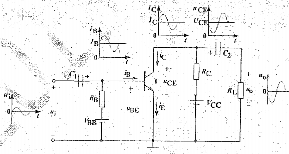
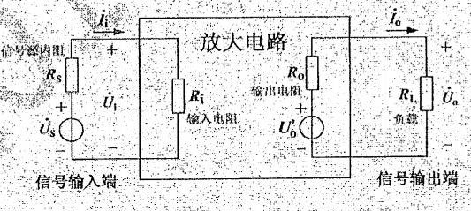
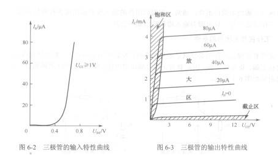
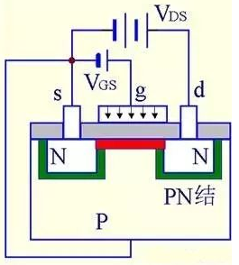
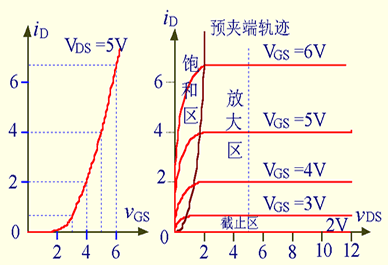
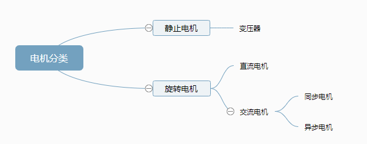

# 电工学

1. 电路的基本概念及定律
    1. 电路分类
        1. 集总参数电路（小）和分布参数电路
        2. 线性电路和非线性电路
        3. 时不变电路和时变电路
        4. 二端元件（一端口元件）和多端元件
    2. 电路中的基本物理量
        1. 电流单位时间里通过导体任一横截面的电量叫做电流强度，简称电流。i = dq/dt。参考方向：任意。实际方向：导体中正电荷的移动方向。
        2. 电压也称作电势差或电位差，是衡量单位电荷在静电场中由于电势不同所产生的能量差的物理量。u = dw/dq。参考方向：任意。实际方向：高电位指向低电位。
        3. 关联参考方向：当元件中电流的参考方向与电压的参考方向设为一致时称为电压电流的关联参考方向，否则称为非关联参考方向。
        4. 功率：单位时间内电场力所做的功。 p = dw/dt = ui。在关联参考方向中，正功率表示吸收功率，该元件是负载元件；负功率是发出功率，该元件是电源元件。
    3. 电路元件
        1. 理想电路元件：从实际器件中抽象出来的具有某种主要电磁性能的理想元件。由理想元件构成的与实际电路对应的电路称为电路模型。
        2. 电阻元件：表示导体材料对电流的阻碍大小，R=ρl/s，单位欧姆。电导G=1/R，单位西门子（S）
        3. 电容元件：表征电路元件储存电荷特性的理想元件C=q/u，单位法拉（F）。i=Cdu/dt，w=0.5Cu²。储能元件、隔直通交、动态元件。串联C=C1C2/(C1+C2),并联C=C1+C2。
        4. 电感元件：表征电路元件储存磁场能量的理想原件，L=Ψ/i。单位：亨利（H）。电感值L的大小取决于材料的磁导率、横截面积、长度、线圈匝数等。u=Ldi/dt，w=0.5Li²。储能元件、阻交通直、动态元件。串联L=L1+L2，并联L=L1L2/(L1+L2)
        5. 理想电压源：内阻为0的电压源，输出电压恒定，输出电流与外电路有关，可开路不可短路。
        6. 理想电流源：内阻无穷大的电流源，输出电流恒定，输出电压与外电路有关，禁止开路可以短路。
        7. 理想电压源 串 电阻：输出电压随电流增大而减小；电源内阻越小，电源外特性越好
        8. 理想电流源 并 电阻：输出电流随输出电压的升高而减小；电源内阻越大电源外特性越好
        9. 受控电源：受电路中另一处电压或电流控制的大院称为受控电源。分为VCVS电压控制电压源，VCCS电压控制电流源，CCVS电流控制电压源，CCCS电流控制电流源。受控电源反映的是电路中某处电压或电流能够控制另一处电压或电流的现象，表示电路中的耦合关系。
    4. 基尔霍夫定律
        1. 名词术语
            1. 支路：流过同一电流的路径（支路数b）
            2. 结点：三条或三条以上支路的连接点（结点数n）
            3. 回路：电路中任意闭合路径（回路数l）
            4. 网孔：平面电路中内部不含支路的回路（网孔数m）
        2. 基尔霍夫电流定律：在集总参数电路中，任何时刻，流入（或流出）任一结点的支路电流点数和恒等于零。
        3. 基尔霍夫电压定律：在集总参数电路中，任何时刻，沿任一闭合回路所有支路电压的代数和恒等于零。
        4. 注解：
            1. n个结点能列n-1个独立的KCL方程
            2. n个结点，b个支路能列写b-(n-1)个独立的KVL方程
            3. 基尔霍夫定律适用于集总参数的线性和非线性电路。定律列写的方程劲与电路结构有关。
    5. 向量法
        1. 复数的表达形式及复数运算
            1. 复数的表达形式
                1. 代数形式：A = a+jb
                2. 三角函数形式：A = |A|cosφ+j|A|sinφ
                3. 指数形式：A = |A|e^jφ
                4. 极坐标形式：A = |A|∠φ
                5. 其中|A| = √(a²+b²)为复数的模，φ=arctan(b/a)为复数的辐角，a = |A|cosφ, b = |A|sinφ
            2. 复数的运算
                1. 加减运算：实部虚部分开加减
                2. 乘除运算：用极坐标形式运算，模乘除，辐角加减
                3. 旋转因子e^jφ是模为1，辐角为φ的复数，任意复数A乘以e^jφ的几何意义是在复平面上将复数A对应的向量旋转一个角度φ，逆时针方向旋转为正角度，A的模值不变。
                4. 相等运算：实部虚部分别相等，或模、辐角相等
                5. 共轭复数：实部相等，虚部相反；或模相等，辐角相反
        2. 正弦量
            1. 正弦量的概念：争先交流电路中电压、电流以及电动势等按照正弦规律变化，统称为正弦量。
            2. 表达式：u = Umsin(ωt+θ)，i = Imsin(ωt+θ)
            3. 正弦量三要素：最大值（幅值）、角频率（频率）、初相位
2. 正弦交流电的分析
    1. （复）阻抗和（复）导纳
        1. （复）阻抗
            1. 阻抗定义：正弦稳态电路中，无源线性一端口的电压向量和电流向量之比为该一端口的阻抗。
            2. 计算：Z = U/I = U/I∠(θu-θi) = |Z|∠φ = R+jX
            3. 理解：
                1. 阻抗模 |Z| =  √(R² + X²)，阻抗角φ = arctan(X/R) = θu-θi
                2. R = |Z|cosφ 称为电阻分量，X = |Z|sinφ 称为电抗分量
                3. R，X，|Z|单位均为欧姆，构成阻抗三角形
            4. 阻抗性质
                1. 若 X>0 则 φ>0，u超前i，呈感性阻抗，称感性电路
                2. 若 X<0 则 φ<0，u滞后i，呈容性阻抗，称容性电路
                3. 若 X=0 则 φ=0，u与i相同，呈阻性，称电阻性电路
            5. 单一元件的阻抗
                1. 电阻：Z=R，φ=0
                2. 电感：Z = jωL = jXL，φ = π/2，感抗XL = ωL
                3. 电容：Z = -j(1/ωC) = -jXc，φ = -π/2，容抗Xc = 1/(ωC)
        2. （复）导纳
            1. 导纳定义：正弦稳态电路中，无源线性一端口的电流向量和电压向量之比为该一端口的导纳。
            2. 计算：Y = I/U = I/U∠(θi-θu) = |Y|∠φY = G + jB
            3. 其他与阻抗类比
            4. 电一元件导纳
                1. 电阻：Y = R，φ=0
                2. 电感：Y = -j(1/ωL) = -jBL，φ = -π/2
                3. 电容：Y = ωC = jBc，φ = π/2
    2. 正弦稳态电路分析
        1. RLC串联电路分析 
            1. KVL：U = Ur + UL + Uc = I(R + jωL - j(1/ωC))
            2. 阻抗模：|Z| = √(R² + X²)，阻抗角φ = arctan(X/R) = θu-θi
            3. 电压有效值：U = √(Ur² + (UL - Uc)²) = |Z|I，Ur、UL、Uc都是正值
        2. RLC并联电路分析
            1. KCL：I = Ir + IL + Ic = U(1/R + j(ωC-1/ωL)) = U(G + jB) = YU
            2. 导纳模：|Y| = √(G² + B²)，导纳角φY = arctan(B/G) = θi-θu
            3. 有效值：I =  √(Ir² + (Ic - IL)²) = |Y|U，Ir、IL、Ic都是正值
    3. 正弦稳态电路的功率
        1. 瞬时功率：p  = ui
        2. 平均功率（有功功率）：P = UIcosφ = ∑Pr，单位W（瓦）
        3. 无功功率：Q = UIsinφ = ∑(Qc + QL)，单位Var（乏）
        4. 视在功率：S = UI = √(P² + Q²)，单位VA（伏安），视在功率不守恒（相位原因）
        5. 复功率
            1. 用于计算的一个复数，模为S（视在功率），辐角为φ，单位VA26
            2. 计算：S（复数） = U∠θu * I∠θi = UI∠(θu-θi) = S∠φ
            3. 关系
                1. 复功率与其他功率关系：S = S∠φ = Scosφ + jSsinφ = P + jQ
                2. 复功率与阻抗、导纳关系：S = UI = ZI² = (R+jX)I² = YU² = (G+jB)U²
                3. 复功率守恒（向量守恒，数值不守恒）
        6. 功率因数：无源一端口的阻抗角的余弦为功率因数，λ = cosφ = cos(θu-θi)
        7. 功率因数的提高：实际负载多为感性（电动机，日光灯等），使电路的功率因数降低，线路损耗大，传输效率低，电气设备的容量不能充分利用。提高功率因数的方法：在负载两端并联电容，用容性无功功率去补偿一部分感性无功功率，以提高输电线路的功率因数。
    4. 最大功率传输定理：含源线性二端正弦稳态网络对可变负载阻抗ZL = RL+jXL供电，当ZL = Zeq(星) = Req-jXeq时，复阻抗ZL获得最大功率Pmax = Uoc²/(4Req)，称为共轭匹配。
    5. 谐振电路
        1. RLC串联谐振
            1. 定义：串联电路中端口电压与端口电流同相位的现象，此时复阻抗虚部为0.
            2. 谐振条件：ωL = 1/ωC
            3. 谐振频率：ω = 1/√LC
            4. 特点：
                1. 阻抗模达到最小：|Z| = R
                2. 电源一定时，电流达到最大 I = U/R
                3. 过电压谐振，U=Ur，UL+Uc=0，UL=Uc=XL*I=Xc*I=XL/R*U=QU
                4. φ=0，λ=1，QL+Qc=0，S=P
                5. 品质因数Q = XL/R = Xc/R = 1/R*√(L/C)，品质因数越大，谐振电路的选择性越好，通频带越窄。
                6. 通频带：当电路偏离谐振频率时，电流幅值下降，当电流衰减最大值的0.707时，即I/I0 = 1/√2时，所对应的频率范围称为通频带。
        2. RLC并联谐振
            1. 定义：并联电路中端口电压与端口电流同相位的现象，此时复导纳虚部为0
            2. 谐振条件：1/ωL = ωC
            3. 谐振频率：ω = 1/√LC
            4. 特点：
                1. 导纳模最小（阻抗最大）：|Y| = G
                2. 电流源电流一定时，端电压达到最大 U = I/|Y| = I/G = RI
                3. 过电流谐振：I = Ir，IL+Ic = 0，IL=Ic=QI
                4. 品质因数：Q = R√(C/L)
3. 放大电路的基本概念
    1. 基本共射极放大电路
        
        1. 组成：
            1. 三极管T：输入信号在基极-射极之间，输出信号在集电极-射极之间
            2. 电源VBB：基极偏置电源，为三极管提供正向偏置电压和基极电流IB
            3. 电阻RB：基极偏置电阻，通过调节阻值来改变IB的大小，从而获得合适的静态工作点。
            4. 电源VCC：为三极管集电结提供反偏电压；为整个放大电路提供能量
            5. 电容C1、C2：隔直通交
        2. 特性：
            1. 输出Uo与输入Ui相位相差180°
            2. 有较大电压电流增益
            3. 一般用作放大电路中间级
            4. 共射极放大器的集电极跟零电位点之间是输出端,接负载电阻
        3. 放大电路的主要性能（简化为线性二端网络）
            
            1. 电压放大倍数：衡量放大电路放大能力的指标
            2. 输入电阻：越大，输入电流越小，信号源的电压损失越小
            3. 输出电阻：越小，放大电路驱动负载能力越强
            4. 通频带：上下限截止频率之间形成的频带宽度称为通频带
        4. 图解分析法
            1. 直流通路和交流通路：先直流（静态）后交流（动态）
            2. 直流通路：电容视为开路，忽略含电容的支路
            3. 交流通路：电容视为短路，电源无交流成分，视为短路
        5. 波形的非线性失真分析
            1. 静态工作点选取的不适当，是引起输出波形失真的主要原因之一
        6. 微变等效电路分析法（没看）
        7. 静态工作点（Q点）的稳定
            1. 温度影响：温度上升，晶体管放大系数、穿透电流增大，导致街电机电流明显增大，Q点上移，易产生饱和失真；反之，温度下降，易产生截止失真。
            2. 分压偏置是稳定静态工作点的一种有效办法
    2. 基本共集电极放大电路
        1. 输入输出同相
        2. 无电压放大作用，电压增益小于1且接近1
        3. 电流增益高
        4. 有功率放大作用，输入电阻最大，输出电阻最小
        5. 适用于作功率放大和阻抗匹配电路
        6. 在多级放大器中常被用作缓冲级和输出级
    3. 基本共基极放大电路
        1. 输入输出同相
        2. 电压增益高
        3. 电流增益低
        4. 功率增益高
        5. 适用于高频电路
    4. 三种放大电路总结
        1. 共射组态放大电路既能放大电压，也能放大电流，属于反相放大电路，输入电阻在三种电路中间，输出电阻较大，通频带是三种电路中最小的。适用于低频电路，常用作低频电压放大的单元电路。
        2. 共集组态放大电路没有电压放大作用，只有电流放大作用，属于同相放大电路，是三种组态中输入电阻最大、输出电阻最小的电路，具有电压跟随的特点，频率特性较好。常用于做电压放大电路的输入级、输出级和缓冲级。
        3. 共基组态放大电路没有电流放大，只有电压放大作用，且具有电流跟随作用，输入电阻最小，电压放大倍数、输出电阻与共射组态相当，属同相放大电路，是三种组态中频率中高频特性最好的电路。常用于高频或宽频带低输入阻抗的场合。
    5. 场效应管放大电路（没看）
    6. 多级放大电路
        1. 分为输入级、中间级、输出级。输入输出级多用共集电极放大电路，提高输入阻抗和输出负载能力
        2. 多级放大电路耦合
            1. 阻容耦合：各直流通路相互独立，静态工作点互不影响，不适合低频信号
            2. 直接耦合：结构简单，低频特性好，适用于直流信号放大电路
            3. 变压器耦合：不能传输直流信号，各静态工作点独立
        3. 性能指标：放大倍数、输入电阻、输出电阻
    7. 功率放大电路
        1. 功率放大电路类型
            1. 甲类：静态工作点设置在交流负载线中点，一只三极管就能对信号的正负半周进行放大，但电路自身损耗大，效率低（最高50%）
            2. 乙类：静态工作点设置在交流负载线的截止点，需要NPN和PNP两只三极管才能得到完整信号，损耗小，转换效率高（最高100%），放大电路靠近截止点附近会产生较大失真
            3. 甲乙类：静态工作点介于甲乙类之间，三极管有一个较小的静态偏置电流，以解决乙类在极值点附近的失真问题。失真情况和转换效率介于甲乙类之间
        2. OCL功放电路：双电源，三极管工作在甲乙类状态，转换效率理论可达75%
        3. OTL功放电路：单电源，三极管工作在甲乙类状态，转换效率理论可达78%
    8. 差分放大电路
        1. 零点漂移、温度漂移
        2. 差分放大电路（抑制漂移）：左右对称、共射极接法，放大差模信号，抑制共模信号
        3. 共模抑制比KCMR：越大越好
4. 集成运算放大器的运算功能
    1. 集成运算放大器
        1. 组成：集成运放是一个高放大倍数的多级放大电路，由输入级、中间级、输出级和偏置电路四部分组成
            1. 输入级由差分放大电路组成，输入电阻大，静态电流小，差模电压放大倍数高，抑制零飘和共模干扰，有很高的共模抑制比
            2. 中间级由共射极放大电路组成，放大倍数高
            3. 输出级一般由OCL互补对称放大电路组成，输出电压线性范围宽，输出电阻小
            4. 偏置电路为各级放大电路建立稳定的静态工作点
        2. 技术指标
            1. 开环放大倍数AOD
            2. 开环差模输入电阻rID
            3. 开环输出电阻rO
            4. 共模抑制比KCMR
    2. 理想运放
        1. 理想运放模型：开环放大倍数无穷大，输入电阻无穷大，输出电阻为0，共模抑制比无穷大
        2. 虚短，虚短
            1. 虚短：同相输入端与反相输入端电位相等 u+ = u-
            2. 虚断：两个输入端电流都为0，i+ = i- = 0
    3. 放大电路中的负反馈
        1. 反馈的基本概念：放大电路输出回路中的某电量的一部分或全部，通过一定方式回送到放大电路的输入回路，并对输入回路中的某电量产生影响
        2. 反馈的判别方法
            1. 正负反馈：根据反馈对净输入信号的影响来判别，瞬时极性法。
            2. 直流反馈和交流反馈：电容（直流开路，交流短路）
            3. 负反馈类型：串联电压负反馈，串联电流负反馈，并联电压负反馈，并联电流负反馈
                1. 串并联判别（输入端）：输入信号与反馈信号是电压比较为串联反馈，电流比较为并联反馈。还有一种判别方法：输入信号和反馈信号在同一端的，则为并联，输入信号和反馈信号在不同端的，为串联
                2. 电压电流判别（输出端）：反馈量与输出电压成正比为电压反馈，与输出电流成正比为电流反馈。可采用负载短路法：负载短路，输出电压为0，若反馈信号也为0，则为电压反馈，否则就是电流反馈（自行总结待验证:反馈与负载电阻RL有关的为电流反馈）
        3. 负反馈对放大电路性能的改善
            1. 稳定放大倍数
            2. 减小非线性失真
            3. 展宽通频带
            4. 对输入输出电阻的影响
                1. 串联负反馈，增大输入电阻；并联负反馈，减小输入电阻
                2. 电压负反馈，减小输出电阻；电流负反馈，增加输出电阻
    4. 集成运放在信号运算方面的应用
        1. 比例运算电路
        2. 求和运算电路（反向求和、同相求和、减法）
        3. 积分电路和微分电路
5. 晶体管的结构和特性
    1. 半导体
        1. 载流子：自由电子、空穴
        2. 本征半导体：完全纯净的半导体（硅、锗）
        3. 掺杂半导体
            1. N型半导体：掺入5价元素（磷），多子（电子），少子（空穴）
            2. P性半导体：掺入3价元素（硼），多子（空穴），少子（电子）
    2. PN结及单向导电性
        1. PN结的形成：将P型半导体和N型半导体制作在一起，交界处形成PN结
        2. PN结的单向导电性：PN结外加正向电压（正偏），内外电场的方向相反，内部电场削弱，空间电荷区变窄，多子的扩散运动被加强，少子的漂移运动被抑制，形成较大的正向电流。PN结外加反向电压，内外电场方向相同，内部电场增强，空间电荷区变宽，阻碍了多子的扩散运动，利于少子漂移运动，形成较小的反向电流。
    3. 半导体二极管
        1. 基本结构和分类
            1. 基本结构：将PN结用外壳封装并在两端引出两根端线而形成的半导体器件
            2. 分类
                1. 按材料分：硅型、锗型
                2. 按结构类型分：点接触型、面接触性、平面型
        2. 伏安特性和主要参数
            1. 伏安特性：特性曲线分为三个部分：正向特性、反向特性、反向击穿特性。正向电压降Uon，硅管0.7-0.8V，锗管0.2-0.3V
            2. 温度对特性曲线影响：温度上升，正向电压曲线左移，负向电压曲线下移
            3. 主要参数
                1. 最大整流电流IF：长期使用允许流过的最大正向电流
                2. 最大反向工作电压UR：超过此值可能会被反向击穿而损坏，通常UR是反向击穿电压的1/2或2/3
                3. 最大反向电流IR：二极管加规定的反向电压而未被击穿时的反向电流。反向电流越小越好，说明二极管单向导电性好，受温度影响小。
        3. 二极管的理想模型：理想开关模型、恒压降模型、斜折线模型
    4. 特殊二极管
        1. 稳压二极管：利用反向击穿的特性达到稳定电压的作用，他的反向击穿是可逆的，只要反向电流不超过允许值。
            1. 稳定电压UZ：稳压管正常工作下两端的电压
            2. 稳定电流IZ：正常工作时的参考电流，一般给出最大值和最小值，稳压管工作电流要在最大值和最小值之间
            3. 动态电阻rZ：稳压管端电压变化量与电流变化量之比rZ = ΔuZ/ΔiZ，动态电阻越小，反向短特性曲线越陡，稳压性能越好
            4. 最大允许功耗PZM：管子不至于损坏的最大功率损耗
        2. 变容二极管：利用PN结的势垒电容效应，工作在反偏。通过改变反偏电压可以改变其容量，常用语自动调频电路。
        3. 光电二极管（光敏二极管）：工作在反偏状态，能将光信号转换成电信号的的检测器件
        4. 发光二极管（LED）：驱动电压低、发光效率高、胜点、寿命长、体积小、可靠性高和抗冲击等优点。光谱较窄，其波长由材料决定
    5. 三极管（晶体管、双极型三极管）
        1. 基本结构和符号
            1. 按种类：NPN、PNP（注意符号）
            2. 按工作频率：高频管、低频管
            3. 按额定功率：大功率管、中功率管、小功率管
            4. 结构
                1. 发射极E：参杂浓度高，多子密度大，易于发射多子
                2. 基极B：薄，参杂浓度低
                3. 集电极C：面积较大，易于对多子收集
        2. 三极管电流放大原理（NPN为例）
            1. 发射极向基极注入电子的过程：发射极正偏，发射极的多子（电子）向基极扩散，基极的多子（空穴）向发射极扩散，共同组成了发射极电流IE
            2. 基极载流子复合与扩散的过程：因为基极很薄且参杂浓度低，发射区来的电子只有极少数与基极的空穴复合，于是发射极与基极之间形成很小的电流IBE，而绝大部分的电子继续向集电极扩散，如果忽略ICBO，则IE≈IBE
            3. 集电极收集载流子的过程：由于集电结外加较大的反向电压，在结内形成了一个很强的由集电极指向基极的电场，故基极中扩散到集电结边缘的电子受到强电场作用，越过集电结进入集电极，形成集电极电流ICE。另一方面，集电结两边的少子的漂移运动，在集电极与基极之间形成反向饱和电流ICBO，数值很小，但对温度敏感，是影响三极管稳定工作的主要因素。如果忽略ICBO，IC≈ICE
        3. 三极管的特性曲线
            
            1. 截止区：发射结和集电结都处于反向偏置，发射极失去发射电子的能力。对于硅管而言UBE<0.5V就开始截止，锗管0.1V。若UBE<0，三极管处于可靠截止状态，这时集、射极之间电阻极大，可视为开路
            2. 放大区：发射结正偏，集电结反偏，三极管工作在放大状态，ΔiC = βΔiB
            3. 饱和区：发射结和集电结都正偏，饱和状态的uCE称为饱和压降UCES，硅管0.3V，锗管0.1V。过饱和状态还要uCE < uCES，这时集、射极之间可视为短路
        4. 三极管的主要参数
            1. 电流放大系数β：太大稳定性差，太小放的能力小
            2. 集-基极反向饱和电流ICBO：少子漂移所致，越小温度稳定性越好，硅管好于锗管
            3. 集-射极反向饱和电流ICEO：穿透电流，越少越好
            4. 集电极最大允许电流ICM：集电极电流超过一定值后，三极管β值下降，当β下降到正常值的2/3时的集电极电流称为集电极最大允许电流ICM
            5. 集电极最大允许耗散功率PCM
    6. 场效应晶体管FET
        1. 概念：场效应晶体管FET，简称场效应管。场效应管仅一种多子参与导电，故又称单极型晶体管，属于电压控制器件。具有体积小、输入电阻高、噪声小、功耗低、易于集成等优点。
        2. 场效应管分为绝缘栅型场效应管MOSFET和结型场效应管。MOSFET又分为N沟道和P沟道两种，每种又可分成增强型和耗尽型
        3. N沟道增强型绝缘栅型场效应管
            1. 它是在一块P型硅衬底上，扩散两个高浓度掺杂的N+区，在两个N+区之间的硅表面上制作一层很薄的二氧化硅（SiO2）绝缘层，然后在SiO2和两个N型区表面上分别引出三个电极，称为源极s、栅极g和漏极d。
            
            1. 工作原理：在MOS管的栅极-源极之间加上正向电压UGS，由于SiO2的作用，栅极电流为零，但在衬底表面形成了一个连接漏极、源极的电子薄层——N型到点沟道。将开始形成导电沟道的UGS称为开启电压，电压越大，沟道越厚，源极、漏极之间的导电能力越强。当N型导电沟道形成后，如果在漏极-源极之间加上正向电压UDS将产生漏极电流ID。由于UDS的存在使得UGS > UGD，沟道靠近源极处最厚，靠近漏极处最薄，导电沟道变成一个楔形。
            2. 特性曲线：
                
                1. 转移特性曲线：上图左所示。只有当UGS > UGSth时，UGS才对ID有控制作用
                2. 输出特性曲线：上图右所示。
                    1. 截止区：当UGS < UGSth时，尚未形成沟道，源漏极之间没有导电能力，呈高阻态
                    2. 恒流区：导电沟道已形成，并处于预夹断状态，ID不在随UDS变化，只受栅源极电压UGS控制
                    3. 可变电阻区：漏源极之间可看成一个线性电阻，阻值随UGS增大而减小。
        4. 其他MOS管
            1. P沟道增前行MOS管
            2. N沟道耗尽型MOS管：无需外加电压就能产生N型沟道，称为初始沟道
            3. P沟道耗尽型MOS管
6. 数据采集系统的组成与功能
    1. 组成
        1. 传感器：将非电量信号转换成电信号
        2. 信号调理电路：进行信号的转换和标准化
        3. 多路模拟开关：共用其他电路，节省成本
        4. 采样保持电路：当对模拟信号进行A/D转换时，需要一定的转换时间，在这个转换时间内，模拟信号要保持基本不变，这样才能保证转换精度
        5. A/D转换：将模拟信号转换成数字信号
        6. 计算机及输出设备：显示、绘图、打印
    2. 分类
        1. 大型专用系统
        2. 分散式系统
        3. 小型专用系统
        4. 组成式系统
    3. 特点
        1. 数据采集系统一般都由计算机控制，使得数据采集的质量和效率等大为提高，也节省了硬件投资
        2. 软件在数据采集系统中的作用越来越大
        3. 数据采集与数据处理结合的日益紧密，集处理到控制的全部工作。增加了系统设计的灵活性
        4. 数据采集过程一般都具有实时的特性，实时的标准是能够满足实际需要，对于通用数据采集系统一般希望有尽可能高的速度，以满足更多的应用环境
        5. 随着微电子技术的发展，电路集成度的提高，数据采集系统的体积越来越小，可靠性越来越高
        6. 总线在数据采集系统中有着广泛的应用，总线技术对数据采集系统结构的发展起到了重要作用
    4. 主要性能指标
        1. 系统分辨率：指数据采集系统可以分辨的输入信号的最小变化量
        2. 系统精度：指当系统工作在额定采集速率下，每个离散值的转换精度。A/D转换器的精度指系统精度的极限值，一般系统精度低于A/D精度。系统精度是系统的实际输出值与理论输出值之差，他是系统各种误差的总和，通常表示为满度值的百分数
        3. 采集速率：指在满足系统精度指标的条件下，系统在单位时间内完成的采集次数
        4. 动态范围：允许输入的最大幅值Vmax与最小幅值Vmin之比的分贝数，即L=20lgVmax/Vmin
        5. 非线性失真：也叫谐波失真。当给系统输入一个频率为f的正弦波时，其输出中出现很多频率kf（k为正整数）的新的频率分量的现象称为非线性失真。
7. 变压器的结构及工作原理
    1. 电机
        1. 定义：泛指所有实施电能生产、传输、使用和电能特性变换的机械或装置。依据电磁感应定律和电磁力定律实现机电能量转换的装置
        2. 分类
            
        3. 材料：铜，硅钢片
        4. 磁滞与磁滞回线：磁滞损耗是铁磁体等在反复磁化过程中因磁滞现象而消耗的能量
        5. 涡流与涡流损耗：在导体内部形成的闭合电流线称为涡流，导体内感生电流导致的能量损耗叫涡流损耗
        6. 交流铁芯损耗：= 磁滞损耗 + 涡流损耗
        7. 电磁定律
    2. 变压器的分类、基本结构、额定值
        1. 变压器分类
            1. 用途：电力变压器、互感器、特殊变压器
            2. 绕组：双绕组、三绕组、自耦
            3. 相数：单相、三相
            4. 冷却：干式、油浸
        2. 结构：铁芯、绕组、油箱、套管
        3. 额定值：
            1. 额定容量：S，视在功率
            2. 额定电压：一次侧、二次侧，三相（线电压）
            3. 额定电流：
                1. 单相：额定功率 / 额定电压
                2. 三相：额定功率 / √3额定电压（线电压）
                3. 三相：额定功率 / 3*相电压
    3. 变压器的空载运行
        1. 空载：变压器一次侧加交流电压，二次侧开路的运行情况
        2. 主磁通与感应电动势的关系
            1. 电动势滞后于磁通90°
            2. 有效值 E = √2πNfΦm
        3. 变比：k = E1/E2 = N1/N2，三相变压器，变比指一次绕组与二次绕组的相值之比
        4. 空载电流：变压器空载运行时，有空载电流建立了主磁通，所以空载电流就是励磁电流
    4. 变压器负载运行
        1. 磁动势平衡方程：I1N1 + I2N2 = ImN1，Im为主磁通
        2. 电压平衡方程
            1. U1 = -E1 + I1Z1，变压器输入电功率变成了感应磁场和线路损耗，负号表示感应磁场产生的感应电动势与输入电压方向相反
            2. U2 = E2 - I2Z2，变压器的输出等于感应磁场能量减去线路损耗
        3. 绕组折算
            1. 定义：把二次侧绕组折算到一次侧绕组，用一个匝数为N1的等效绕组，去替代原变压器匝数为N2的二次侧绕组
            2. 折算公式
                1. 电流：I = I2/k
                2. 电动势：E = kE2
                3. 阻抗：Z = k²(Z2+ZL)
        4. 等效电路
    5. 变压器参数测定
        1. 空载试验：测定变比k，空载损耗P0，空载电流I0以及励磁阻抗Zm
        2. 短路实验：求得变压器的负载损耗，短路阻抗Zk
        3. 标幺值：有名值比基准值
    6. 三相变压器
        1. 按磁路分：组式变压器（三相磁路独立）、芯式变压器（三相磁路对称）
    7. 自耦变压器
8. 三相异步电动机的结构与原理
    1. 三相异步电动机（感应电动机）概述
        1. 异步电机的类型和结构
            1. 异步电机主要做电动机使用
            2. 结构：
                1. 定子：铁芯、绕组
                2. 转子：铁芯、绕组（笼型、绕线型）、转轴
                3. 气隙：尽可能小
        2. 额定值
            1. 额定功率：转轴输出的机械功率，T(Nm) = 9550P(kw)/n(rpm)
            2. 额定电压：定子绕组线电压
            3. 额定电流：额定工组状态下，线电流
            4. 额定频率：50Hz
            5. 额定转速：额定工组状态下，转速
            6. 额定效率：ηN
            7. 额定功率因数：cosφN
            8. PN = √3UNINηNcosφN
        3. 工作原理
            1. 定子绕组流过三相对称电流，在气隙中形成旋转磁场。定子磁场同步转速为n1 = 60f/p，p-极对数。转子绕组切割磁感线产生感应电动势，从而使转子绕组中产生感应电流。转子绕组中的感应电流与磁场作用，产生电磁转矩，使转子旋转。
            2. 转差率：转速差与同步转速比值 s = (n1-n)/n1
            3. 异步电动机三种运行状态
                1. 0 < s < 1，电动机运行状态
                2. s < 0，转子转速大于同步转速，发电机状态
                3. s > 1，转子转速反向，电磁制动状态
    2. 三相异步电动机的运行原理
        1. 转子静止时：
            1. 转子开路：E = √2πNfΦm
            2. 转子短路
                1. 定、转子磁动势相对静止
                2. 转子磁动势与定、转子绕组间的夹角无关
            3. 电动势平衡方程
            4. 磁动势平衡方程
            5. 转子绕组折算
        2. 转子旋转时
            1. 转子电动势：f2 = sf1，E = sE转子静止
            2. 定、转子磁动势依然相对静止
            3. 频率折算
            4. 等效电路
        3. 异步电机等效电路简化
        4. 异步电机参数测定
    3. 三相异步电动机的运行特性（没看）转矩与电压平方成正比
    4. 三相异步电机的启动与调速
        1. 启动电流大、转矩小
        2. 启动方式
            1. 直接启动：转矩小，电流大
            2. 降压启动：
                1. 定子串电阻：电流与电压一次方关系降低，转矩与电压呈平方倍降低
                2. 用Y-Δ启动器：电流、转矩降为直接启动的1/3
                3. 自耦变压器：启动电流和启动转矩平方倍降低
            3. 采用高启动转矩异步电机
            4. 采用绕线式异步电机
        3. 制动方式
            1. 反接制动：转速反向和两相反接
            2. 反向回馈制动
            3. 能耗制动
        4. 异步电动机的调速
            1. 变极调速 n = 60f/p，变p
            2. 变频调速 变f
            3. 转子串电阻调速，改变转差率s
            4. 降压调速，属于变转差调速