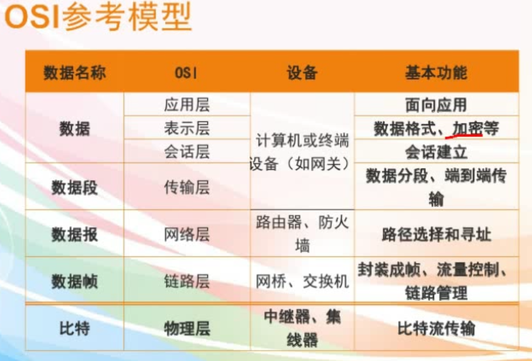
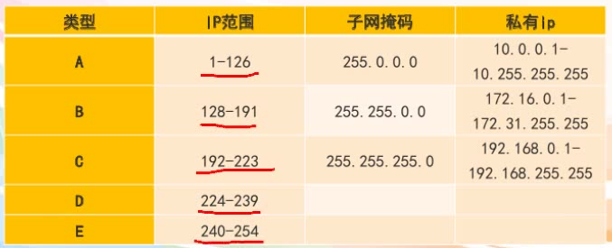

# 计算机基础

1. 计算机基础知识（计算机定义、组成、进制、操作系统等）
    1. 定义：现代一种用于高速计算的电子计算机器，可以进行数值计算，又可以进行逻辑计算，还具有存储记忆功能。是能够按照程序运行，自动、高速处理海量数据的现代化智能电子设备。
    2. 冯诺依曼结构：输入数据和程序的输入设备；记忆程序和数据的存储器；完成数据加工处理的运算器；控制程序执行的控制器；输出处理结果的输出设备。
    3. 计算机组成
        1. 硬件系统
            1. 主机
                1. cpu：运算器、控制器、寄存器
                2. 内存储器：
                    1. ROM只读存储器（PROM可编程只读存储器，EPROM可擦可编程序只读存储器，EEPROM电可擦可编程只读存储器）
                    2. RAM随机存储器（掉电丢失，SRAM静态RAM，DRAM动态RAM需要刷新）
            2. 外设
                1. 外存储器
                2. IO设备
                    1. 输入设备
                    2. 输出设备
        2. 软件系统
            1. 系统软件：操作系统、数据库管理系统DBMS/DMS等
            2. 应用软件：为了完成某些特殊功能
    4. 计算机数制采用二进制。
    5. 进制转换，二进制、八进制、十进制、十六进制
    6. 计算机应用：
        1.  科学计算（最早）
        2.  数据处理（最多）
        3.  数据库应用
        4.  过程控制（实时控制）是指极端及对被控对象进行数据采集、检测和处理，按最佳状态来控制或调节被控对象的一种方式
        5.  计算机辅助应用
            - 计算机辅助工程CAE
            - 计算机辅助测试CAT
            - 计算机辅助制造CAM
            - 计算机辅助教学CAI
            - 计算机辅助设计CAD
        6. 人工智能AI，用计算机来模拟人的只能行为。
            1. 决策支持系统不属于AI应用
    7.  计算机发展方向：巨型化、微型化、多媒体化、智能化
    8.  操作系统：操作系统是连接计算机硬件和软件的纽带，是计算机系统中最基本也是最核心的系统软件。一般来讲，所谓操作系统是指能合理而且有效的管理计算机所有阴间资源和软件资源的系统软件。
        1. 裸机：没有安装操作系统的进算计
    9. 操作系统的功能
        1. 从用户角度看，操作系统是用户和计算机的接口
        2. 处理器管理
        3. 存储器管理
        4. 设备管理：指外部设备
        5. 作业管理
        6. 文件管理（树形结构）：存储空间的分配和回收，文件的读写、查找、共享
    10. 操作系统分类
        1. 单道批处理操作系统：用户一次可以提交多个作业，但负责调度作业的程序每次只向内存调入一个作业，系统一次也只处理一个作业，失去交互性。
        2. 多道批处理操作系统：内存同时保存多个作业，CPU以交替的方式处理各个程序。当一个作业由于等待输入输出操作而让处理器出现空闲时，系统可以自动进行切换，处理另一个作业。
        3. 分时操作系统：结合了交互处理与多道批处理的特点。
        4. 实时操作系统：可以及时响应外部时间的请求。
        5. 网络操作系统：通常运行在服务器上的操作系统，其目标是相互通信和资源共享。
        6. 微机操作系统
2. 网络技术基础（定义、拓扑结构、协议、差错控制、Internet）
    1. 定义：计算机网络是指将地理位置不同的具有独立功能的多台计算机及其外部设备，通过通信线路连接起来，在网络操作系统，网络管理软件及网络通信协议的管理和协调下，实现资源共享和信息传递的计算机系统。在协议管理下的多机互联系统。
    2. 起源：美国 ARPA net 1969 军事用途
    3. 网络分类：
        1. 按照覆盖范围：局域网LAN（范围小、用户少、效率高）、城域网MAN（10-100km，局域网的延申）、广域网WAN（几百-几千km，信息衰减比较严重）
        2. 按拓扑结构分：
            1. 星型网络（局域网用）
            2. 环形网络（局域网用、令牌环网）
            3. 总线型网络（广播式、以太网、广泛）
            4. 树形网络（容错）
            5. 网状网络（稳定性更好）
        3. 通信方式
            1. 客户服务器方式（C/S方式）
            2. 对等连接（P2P），任何一方都可以作为服务请求方和服务提供方。
        4. 按照网络中各种设备功能
            1. 资源子网：包括联网的计算机、终端、外部设备、网络协议和网络软件。他的主要任务时负责收集、存储、和处理信息，为用户提供网络服务和资源共享功能。
            2. 通信子网：把各个站点连接起来的通信系统，主要包括通信线路、网络连设备、网络协议和通信控制软件。
    4. OSI参考模型
        1. 
    5. 网络设备
        1. 中继器：信号的放大和再生，在物理层
        2. 集线器：多端口中继器，在物理层
        3. 网桥：扩展局域网，连接两个协议相同的局域网，在链路层
        4. 交换机：用于电信号转发，在链路层
        5. 网关：网络层以上实现网络互联，连接两个高层协议不同的网络
        6. 路由器：连接两个不同的网络（局域网、广域网），路由选择，以最佳路径传输，在网络层
        7. 调制解调器：数字信号和模拟信号转换，拨号上网必备，调制D/A，解调A/D
        8. 网络适配器（网卡）：计算机入网必备
    6. 协议三要素：语法、语义、时序（同步）
    7. 网络地址
        1. IP地址：Internet网络为每台计算机分配的唯一标识，32位地址（4字节），由网络号和主机号组成
        2. 点分十进制的标识形式
        3. 
3. 多媒体技术基础（媒体定义、多媒体组成、数据压缩）
    1. 媒体：指传播信息的载体，如语言、文字、图像、视频、音频等等
    2. 多媒体技术：是利用计算机对文本、图形、图像、声音、动画、视频等多种信息综合处理、建立逻辑关系和人机交互作用的技术。
4. 信息安全技术(定义、风险及防范、病毒及防范、加密技术）
5. 信息科学前沿（云计算、传感网、人工智能、数据挖掘、机器学习）
    1. 云计算
    2. 传感网
    3. 人工智能AI
    4. 数据挖掘
    5. 机器学习